<h1 align="left">
  <br>
  
  <br>
  HEI-Vs Engineering School 
</h1>
  
<h2>   Automation in Development and Production </h2>
  <br>

Course DLS/ADP

Authors: [Cédric Lenoir](mailto:cedric.lenoir@hevs.ch), [Thomas Sterren](mailto:thomas.sterren@hevs.ch)

> Version 2026, V1.0

**Reference to this repository:** [adp-lab-database](https://github.com/hei-dls-adp/adp_lab_05_2026)

# LAB 05: Introduction to Data Storage and Visualisation

*Keywords:* **Node-Red, InfluxDB, Database, InfluxDB, Flux, InfluxQL, Grafana, Visualisation**

## Table of Contents

<!-- TOC -->
* [LAB 05: Introduction to Data Storage and Visualisation](#lab-05-introduction-to-data-storage-and-visualisation)
  * [Table of Contents](#table-of-contents)
* [Objectives](#objectives)
* [Why Using a Database in Automation](#why-using-a-database-in-automation)
* [Environment Overview](#environment-overview)
  * [Laboratory PC with ctrlX COREVirtual](#laboratory-pc-with-ctrlx-corevirtual)
* [Set up Virtual ctrlX Core Instance](#set-up-virtual-ctrlx-core-instance)
  * [Virtual ctrX Core - Network Configuration](#virtual-ctrx-core---network-configuration)
    * [Optional - Forwarding an Additional Port (ex. 8086)](#optional---forwarding-an-additional-port-ex-8086)
  * [Start Virtual ctrlX Core Instance](#start-virtual-ctrlx-core-instance)
* [Install InfluxDB on ctrlX OS](#install-influxdb-on-ctrlx-os)
  * [Access the ctrlX OS Store](#access-the-ctrlx-os-store)
  * [Find and Install InfluxDB](#find-and-install-influxdb)
  * [Configure InfluxDB](#configure-influxdb)
    * [Start Configuration](#start-configuration)
    * [Basic Configuration](#basic-configuration)
    * [Store API Token](#store-api-token)
    * [Database in 'Data Explorer'](#database-in-data-explorer)
    * [Access InfluxDB interface](#access-influxdb-interface)
  * [Other Setup Topics](#other-setup-topics)
    * [Set up Data Retention](#set-up-data-retention)
    * [Create Additional Users and Permissions](#create-additional-users-and-permissions)
  * [Additional Resources](#additional-resources)
* [Using Node-RED to push Data into InfluxDB](#using-node-red-to-push-data-into-influxdb)
  * [Install Node-RED App](#install-node-red-app)
  * [Node-RED: Install InfluxDB package](#node-red-install-influxdb-package)
  * [Node-RED: Generate and Push Random Data](#node-red-generate-and-push-random-data)
    * [Generate Random Environment Sensor Data](#generate-random-environment-sensor-data)
      * [Deploy and Test Sensor Data Storage](#deploy-and-test-sensor-data-storage)
    * [Generate Sine Wave Signal](#generate-sine-wave-signal)
* [Using Node-RED to Fetch Data from InfluxDB](#using-node-red-to-fetch-data-from-influxdb)
  * [Node-RED: Read Data from InfluxDB](#node-red-read-data-from-influxdb)
    * [Using Data Explorer to Build Flux Query](#using-data-explorer-to-build-flux-query)
* [Install Grafana on ctrlX OS](#install-grafana-on-ctrlx-os)
  * [Install _IoT Dashboard_ App](#install-_iot-dashboard_-app)
    * [Next Steps](#next-steps)
  * [Configure New _Data Source_](#configure-new-_data-source_)
  * [Create First Dashboard](#create-first-dashboard)
<!-- TOC -->

# Objectives
Understand the basic usage of a time-series database and how to access and visualise the stored data.

To achieve these objectives, the following exercises will be carried out:

- Install InfluxDB (time-series database)
- _Connecting data sources_: Write data into InfluxDB using Node-Red (sensors, PLCs, etc.)
- Fetch data from InfluxDB and show it on a graph using build-in _Data Explorer_
- Install Grafana for monitoring and visualisation
- Create Grafana dashboard to visualize data from time-series database
- _Optional:_ Configure alerts for critical conditions

# Why Using a Database in Automation

In modern automation systems, data is constantly being generated from sensors, machines, and processes. To make this data useful for monitoring, analysis, and decision-making, we need a reliable way to store and retrieve it over time.

An efficient and fast way is to store the data into a database. Every datapoint stored needs to have its timestamp allowing to reliably analyse historical data. Reading/fetching data from the database needs to be fast too. This is achieved by providing the user with a query language allowing to receive specific data out of the database.

> Note: Accessing a database is much faster than reading a text file containing the whole information and iterating over each dataset!

In this laboratory we are going to use InfluxDB, a time-series database providing all the needs mentioned above:
- Fast storage of new datapoints
- Handles increasing amounts of data
- Fast queries to access historical data
- Real-time data access for monitoring and visualisation

# Environment Overview
## Laboratory PC with ctrlX COREVirtual
Today's laboratory you need to realise using the **laboratory PC**. We are going to use a virtual `ctrlX Core` instance inside the `ctrlX WORKS` application. Even if you have `ctrlX WORKS` installed on your own Laptop you may not be able to fully realise it with your Laptop. 

On the virtual `ctrlX Core` instance we are going to install and use the following apps:
- Node-RED
- InfluxDB
- IoT Dashboard (containing Grafana)

Let's go on by starting the `ctrlX WORKS` application and set up a virtual `ctrlX Core` instance.

# Set up Virtual ctrlX Core Instance
In the `ctrlX WORKS` application select the `Devices` view and create a new virtual `ctrlX Core` instance by clicking on the  button in the upper-right corner. Select _Create a new ctrlX COREvirtual_ and name the new instance for example `VirtualControl-InfluxDB`.

> Note: In case there is already an instance with the same, delete it first and create a new one.

## Virtual ctrX Core - Network Configuration

_CtrlX COREVirtual_ is based on [QEMU](https://www.qemu.org/), an operating system emulator. Per default, the system runs in an isolated environment and does not have access to the Internet, nor can we access a software running inside the environment via Ethernet. This limitation can be altered in the settings.  

Click on the pencil icon to change the configuration. Click on the _Extended_ tab and change the configuration to **Port forwarding**. This allows applications running inside the virtual environment to reach the other world.

Save the configuration. 

You can now start the ctrlX Core instance (ctrlX OS) and after startup access it via the https://127.0.0.1:8443 link.

### Optional - Forwarding an Additional Port (ex. 8086)

In case you having problems to reach InfluxDB via port 8086 you may need to enable port forwarding for this port. This can be done in the _ctrlX COREVirtual_ settings:

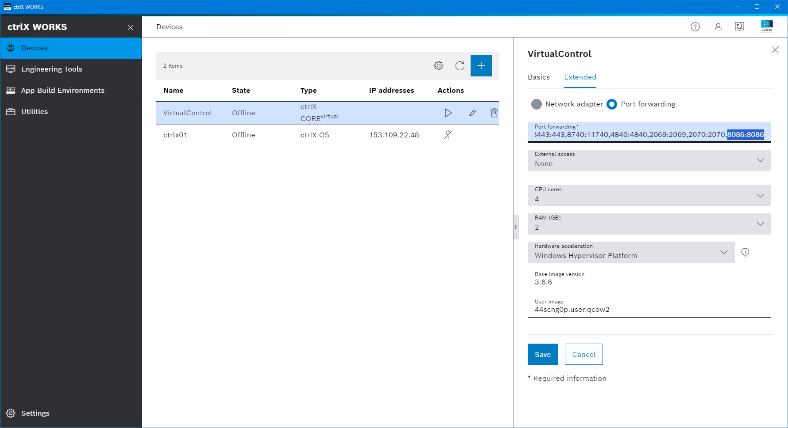

- Stop the running ctrlX OS instance
- Press the pencil icon to enter the Settings for _ctrlX COREVirtual_ 
- Select the Extended tab
- Change network configuration (from _Network Adapter_) to _Port forwarding_
- Extend the _Port forwarding_ field with `8086:8086`

Adding this entry means _"Forward the internal port 8086 and expose it to the accessible interface on port 8086"_
   
> Note: The _Port forwarding_ field contains comma separated entries!

> Note: In case the port `8086` is already used on the laboratory PC you need to take another port. When taking for example the port `8090` you need to change the expression to `8090:8086`.

## Start Virtual ctrlX Core Instance
Start then the instance using the ▶️ icon in the _Actions_ column. Wait a bit until the application properly started and click then on the `VirtualControl-InfluxDB` to get forwarded to its webinterface. You can log in with the following default credentials:

- _Username_: **boschrexroth**
- _Password_: **boschrexroth**  

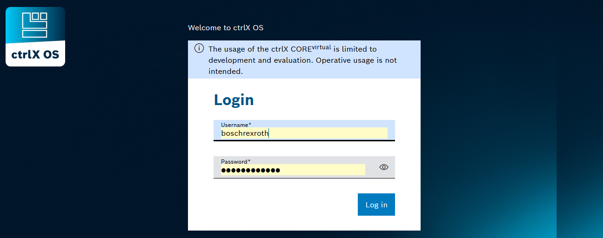

Now you have your virtual `ctrlX Core` instance running and are ready to install additional apps:

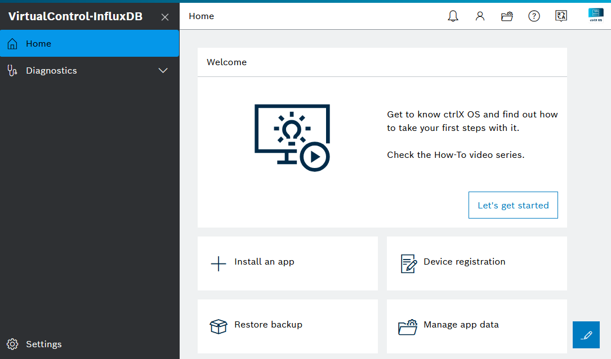

# Install InfluxDB on ctrlX OS

This section will guide you through installing InfluxDB on your ctrlX OS system. InfluxDB is a powerful time-series database that's perfect for storing and analyzing automation data.

## Access the ctrlX OS Store

Click on "Settings ➡ Apps" in the main navigation menu. This will show you all available applications and services:

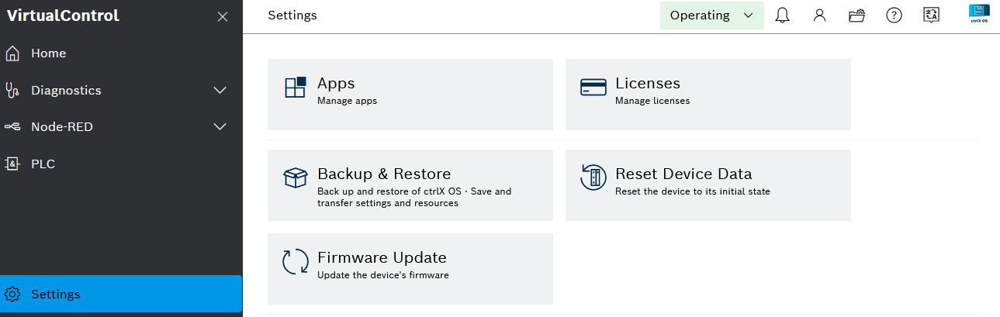

## Find and Install InfluxDB
You may press the _Visit App Store_ button to search for the InfluxDB application, but on this side it's rather a tedious way to find the application needed. Furthermore, you need to create an account and afterwards login to receive the application install executable.

To simplify this process we provide you the _InfluxDB.app_ file also on the laboratory PC. It is located in the `C:\Users\Public\ctrlX\apps` folder and is named `InfluxDB IDB-3.6.2+2.7.11.app`.

After downloading the file you can press the _Install from file_ button and reference the downloaded file to install the InfluxDB application. 

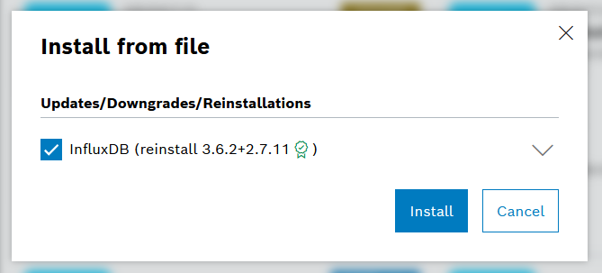

Click the _Install_ button. After installation the application shows up in the _Installed apps_ list:

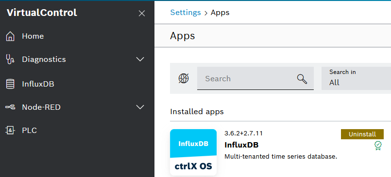

The InfluxDB is now running on your ctrlX OS and you have a new _InfluxDB_ entry in the main navigation menu.

> Note: InfluxDB also provides a web interface to configure and access the database. Example: https://127.0.0.1:8443/influxdb (or https://127.0.0.1/influxdb)

## Configure InfluxDB

When clicking on the _InfluxDB_ icon in the main navigation menu, a new website gets opened pointing the InfluxDB web interface. When calling this webside the first time you need to provide some information in order to configure the database.

### Start Configuration

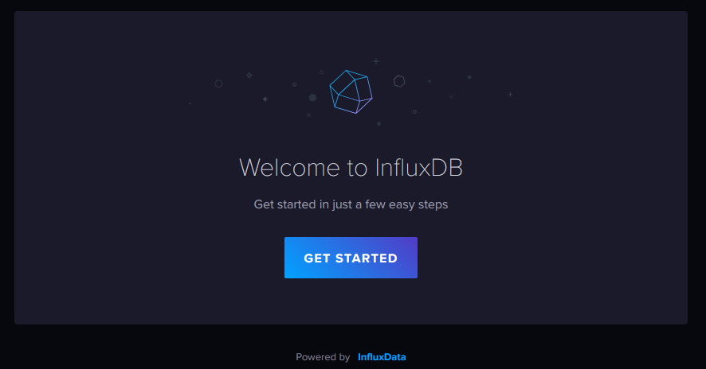

Press the _GET STARTED_ button to start configuration.

### Basic Configuration
Set up initial user information as shown in the figure below:

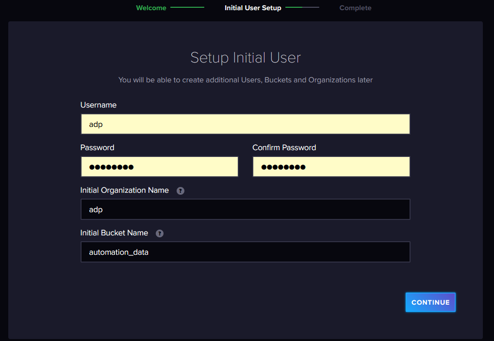

- Set up database credentials:
   - _Username_: **adp**
   - _Password_: **AdpX2033**
- Configure database:
   - Organisation: **adp**
   - Database (bucket) name: **automation_data**

> Note: As you can derive from the information entered an InfluxDB installation can handle data for multiple companies/organisations and also multiple databases (buckets) per organisation.

### Store API Token
After finishing the initial user set up the API token is shown a page:

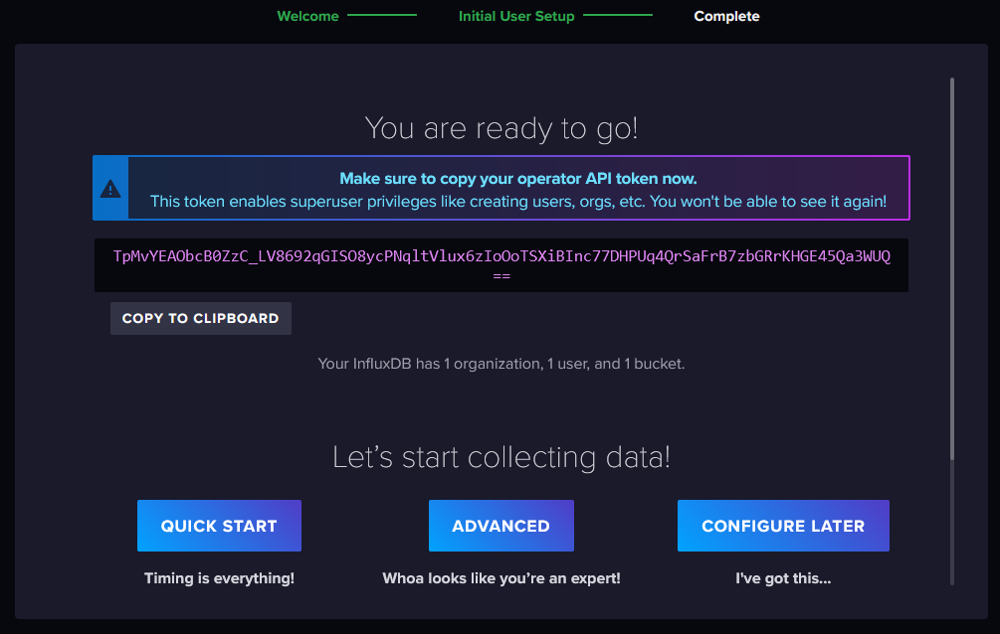

> Note: It is important to copy and write down the API token somewhere on you computer. It is the only time you will see it and you need the token to access the database afterwards!

TODO: COPY AND PASTE THE `API TOKEN` INTO A FILE!

### Database in 'Data Explorer'
You can check in the _Data Explorer_ view that the bucket (database) was created:

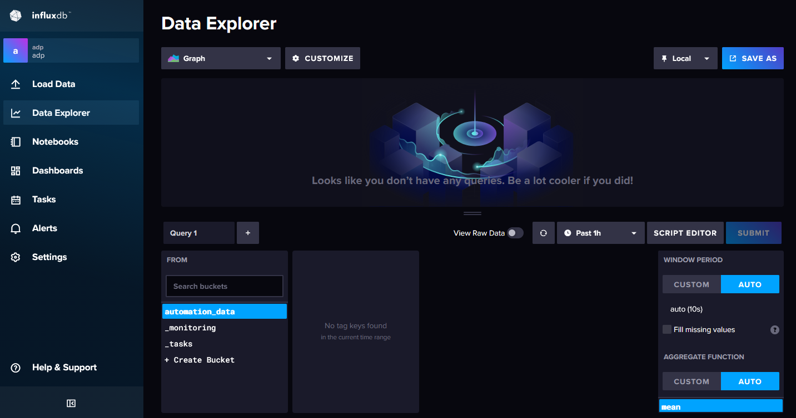

After pushing some data into the _automation_data_ bucket, you can query and examine the data on this view.

> Note: To enter data to the InfluxDB you should use other tools. You shouldn't add data via the InfluxDB web interface! We are going to use Node-RED for this task.

### Access InfluxDB interface
After the _initial user_ configuration you can navigate to the InfluxDB web interface via the new InfluxDB view added to the ctrlX OS instance:

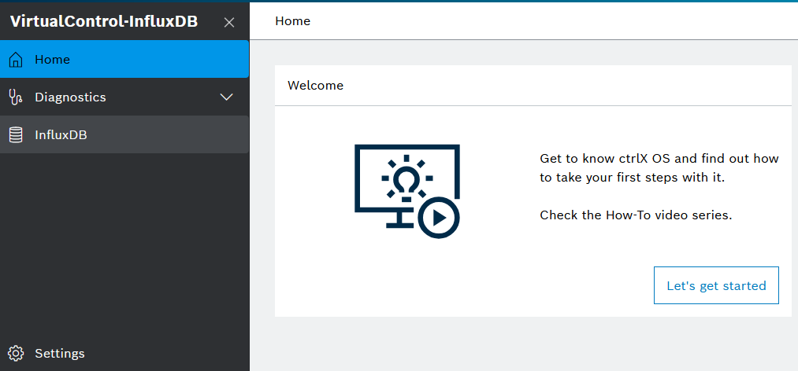

For the login you need to provide the user credentials you configured during _initial user_ setup.

## Other Setup Topics
Remains to mention some other topics you might consider to do, but we do not cover in this document:

### Set up Data Retention
- Configure how long to keep data
- Set up automatic cleanup policies

### Create Additional Users and Permissions
- Set up user accounts for different access levels
- Configure read/write permissions

## Additional Resources
For detailed information about using InfluxDB with automation data, refer to the official InfluxDB documentation and the specific guides for your ctrlX OS version:

- [ctrlX OS Store - InfluxDB](https://community.boschrexroth.com/ctrlx-os-store-apps-oc2pqqwn/post/ctrlx-automation---influxdb-V29ngs0fTFBajQu)
- [IIoT: Use ctrlX CORE as a monitoring platform using InfluxDB and Grafana](https://community.boschrexroth.com/ctrlx-automation-how-tos-qmglrz33/post/iiot-use-ctrlx-core-as-a-monitoring-platform-using-influxdb-and-grafana-xjzxEohXG2ofAgp)
- [Getting started with InfluxDB on ctrlX CORE](https://community.boschrexroth.com/ctrlx-automation-how-tos-qmglrz33/post/getting-started-with-influxdb-on-ctrlx-core-G3RGwcMjZH9IKJ7)

# Using Node-RED to push Data into InfluxDB

With the times-series database set up we are going to use Node-RED to add/push some random generated data into InfluxDB. For this we need to do the following:

1. Install Node-RED app in ctrlX OS
1. Install Node-RED InfluxDB package
1. Generate random data and push it into InfluxDB
1. Validate and display the added data using InfluxDBs _Data Explorer_

## Install Node-RED App
In case the Node-RED App is not installed in ctrlX OS - install it. The installer file is located in the `C:\Users\Public\ctrlX\apps` folder of the laboratory PC: `Node RED RED-3.6.5+4.0.9-ctrlx.app`

## Node-RED: Install InfluxDB package
Use the _Palette_ view in the Settings to add the _node-red-contrib-influxdb_ package. 

Click on the menu icon in the top-right corner and click on _Manage Palette_ (Shortcut: SHIFT+ALT+P):

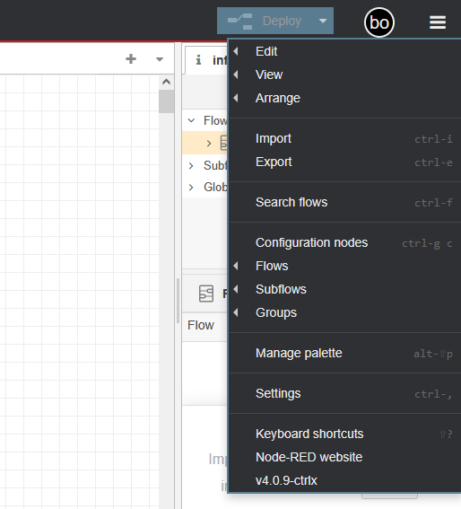

Then click on the _Install_ tab to add new packages:

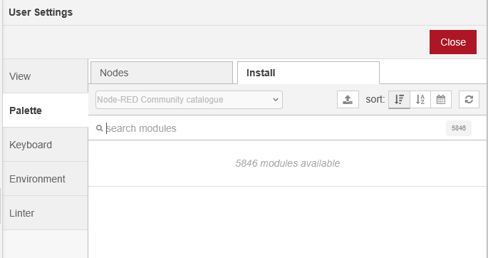

In the search field search for packages named **_influxdb_** and install the package named _node-red-contrib-influxdb_:

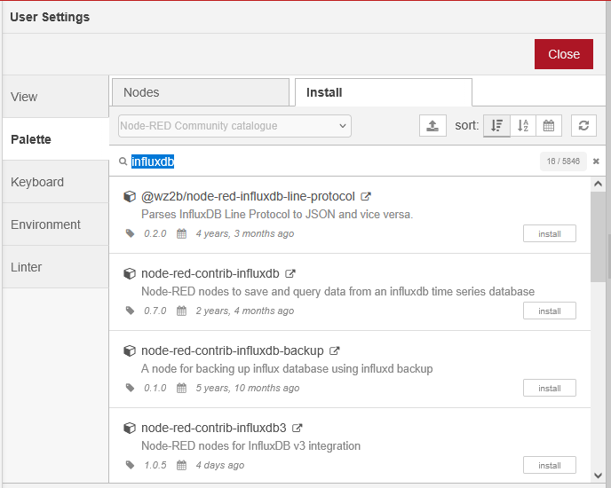

Check the name of the package to install and start installation by clicking on the _Install_ button:

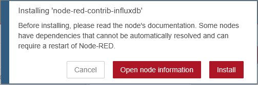

After installation, you can click on the _Nodes_ tab and find the package in the list of installed packages:

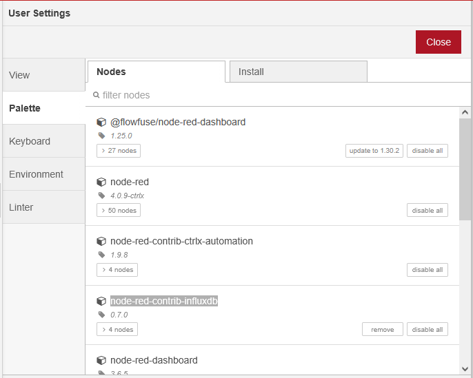

The package has added 3 additional nodes in the **storage** section of the nodes browser:

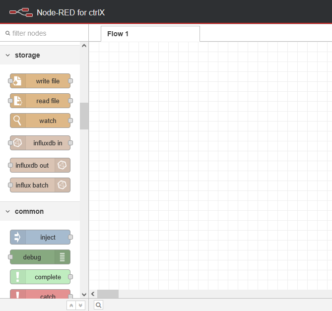

- The 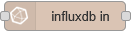 node is used to query and **receive data** from InfluxDB
-  is used to **send data** to InfluxDB
-  is used to send a set of data points (with an extended format) to InfluxDB at once

For more information refer the documentation page of the [node-red-contrib-influxdb](https://flows.nodered.org/node/node-red-contrib-influxdb) package.

## Node-RED: Generate and Push Random Data
Now we want to generate some data and push it afterwards into the database. 

We have prepared two examples: One with the _random node_ emulating environment sensor data and one with a _function node_ generating a sine wave shaped signal. You can add both examples and let them run in parallel.

> Note: The explanations later in the laboratory document are based on the _sine wave_ data, but can be also applied to the environment sensor data. 

### Generate Random Environment Sensor Data

We want to emulate an environment sensor measuring temperature and humidity of a room. The sensor shall take a measurement every five seconds and send the collected information to the InfluxDB. Here is an example of how this task can be realised with a Node-RED flow:

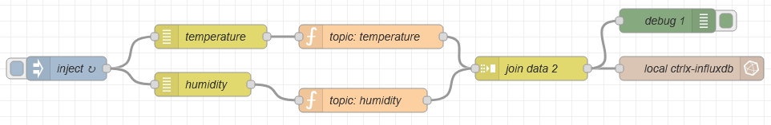

To trigger the flow every five seconds we need an _inject node_: 

Configure the _inject node_ to trigger every 5 seconds and specify the name of the InfluxDB table (time series) using the `measurement` attribute of the `msg` object:

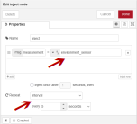

In the example above the data will get stored into the _environment_sensor_ table.

Create some random data using the _random node_ : 

Of course, you need two objects of this node to individually generate data for the _temperature_ and the _humidity_ value. Following is an example configuration for the temperatures _random node_:

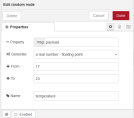

The node will generate a value between `17` and `23` each time it gets triggered and stores it into the `payload` attribute of the `msg` object.

Next we need to specify in which column each information gets stored in the table. This is done with the `topic` attribute of the `msg` object. Add a _function node_  and configure the node accordingly. Here an example for the temperature _function node_:

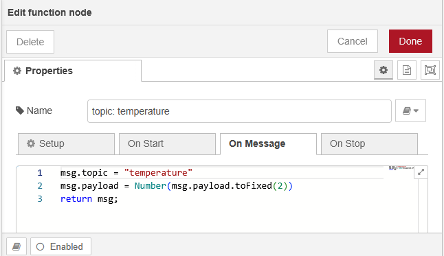

>Note that in the example above a value conversion was made to cut the float value to two digits behind the comma using the `toFixed()` method.

Before transmitting the sensor data using the _influxdb out node_ we need to join the two `msg` objects into one data object. This can be done using the _join node_ . This node takes the two `msg` objects and puts them into a single map (containing two _key/value_ objects).

Configure the _join node_ as follows:

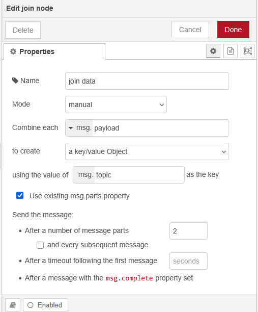

> Note: Based on the `msg.topic` an entry in the map is generated, where the value of the entry is based on the `msg.payload`.

Finally, we can send the map containing the sensor data to the InfluxDB using the _influxdb out node_: 

Configure the InfluxDB server to which to send the information by pressing on the + button: 

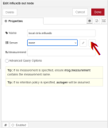

The enter the information for the InfluxDB server as follows:

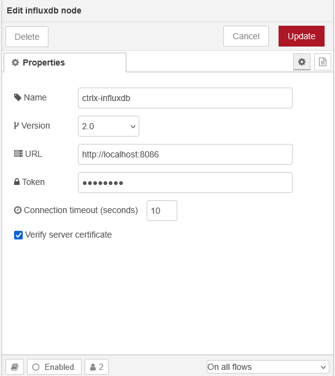

- **Name**: A name that best describes the database
- **Version**: We use InfluxDB version `2.0`
- **URL**: In case the InfluxDB runs on the local computer: `http://localhost:8006`
- **Token**: The API token you saved into a file

Back on the original configuration window you need to provide the name for the organisation and the bucket:

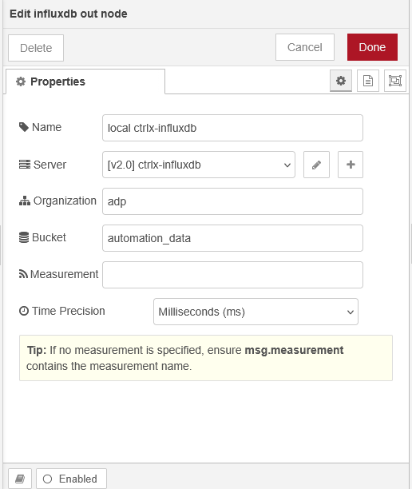

- **Organization**: `adp` 
- **Bucket**: `automation_data`

> Note: As we provided the name for the _measurement_ already in the _inject node_, it is not necessary to provide it here.

#### Deploy and Test Sensor Data Storage

To test the actual flow we need to deploy it using the  button.

Then you can check if the data is generated correctly by adding a _debug node_ to the output of the _join node_. On the debug view a similar output should be shown:

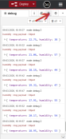

Open the InfluxDB web interface in the browser (ex. http://127.0.0.1:8443/influxdb) and check in the _Data Explorer_ if the _environment_sensor_ table is present in the _automation_data_ bucket and contains the fields _humidity_ and _temperature_:

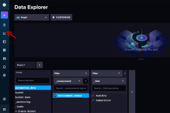

> Note: In case the _automation_data_ bucket is not present you can create it with the `➕ Create Bucket` button.

### Generate Sine Wave Signal
Now, you can generate some more data to be pushed into the InfluxDB. This example shows how to generate a sine shaped signal:

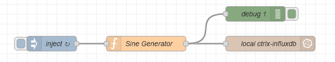

The _inject node_ triggers regularly the **Sine Generator** _function node_ which puts then the data resemble to a sine wave into the InfluxDB.

The configuration for the _inject node_ may look as follows:  
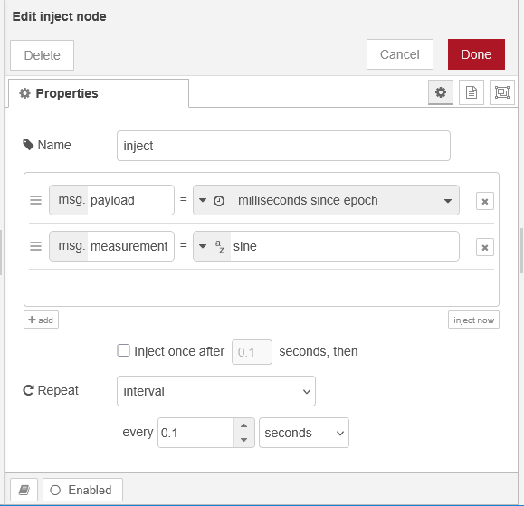

- Want to send every `100` milliseconds an information (0.1 seconds)
- The data shall be written into the `sine` table (`msg.measurement = sine`)

> Note: The `milliseconds timestamp` added to the `msg.payload` object may not be necessary!


The JavaScript code for the  looks as follows:
```javascript
// Allow overrides via incoming message
var frequency = msg.frequency !== undefined ? msg.frequency : 0.1;
var amplitude = msg.amplitude !== undefined ? msg.amplitude : 10;
var offset    = msg.offset    !== undefined ? msg.offset    : 0;

var now   = Date.now() / 1000;

// Generate actual value for the sine wave 
var value = amplitude * Math.sin(2 * Math.PI * frequency * now) + offset;

msg.payload = {
    value: parseFloat(value.toFixed(4)),
};

return msg;
```
Add the code into the code section of the _On Message_ tab of a _function node_.

Connect the nodes according to the figure shown above, deploy and test if the data gets correctly written into InfluxDB.

Here an example of the sine wave displayed by the InfluxDB _Data Explorer_:  
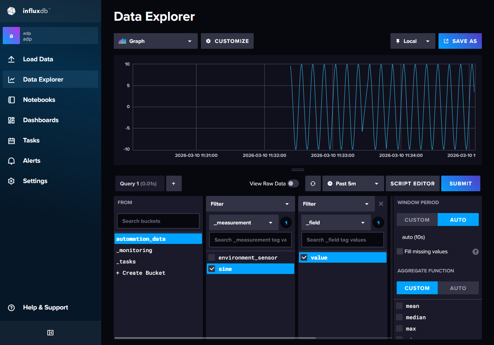

> Note: You may disable the _mean_ functionality in the _aggregate function_ to properly display the raw data stored into the database.

# Using Node-RED to Fetch Data from InfluxDB
Now as we know how to write data into the InfluxDB database we can head on to read and display data from the InfluxDB.

## Node-RED: Read Data from InfluxDB

To read data from InfluxDB you need the  node. The input needs to be connected to an  node defining when and at which interval the _influxdb in_ node gets triggered (when to request data from InfluxDB). 

Following, you will find an example on how to request and show data from InfluxDB:  
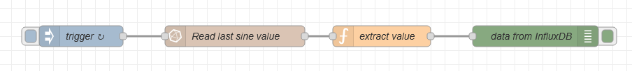

The _inject_ node starts the request to read data from InfluxDB. The received data is given to a _function_ node to post treat the received data and gets finally displayed in the debug view using the _debug_ node.

The tricky part here is to find the right query string to get the right information from the InfluxDB. 
The Query language used in the _influxdb in_ node is named _Flux_ and the documentation can be found here [Flux Documentation](https://docs.influxdata.com/flux/), but for now take the query provided below and copy/paste it into the _influxdb in_ node to receive the _sine_ measurement:

```javascript
from(bucket: "automation_data")
  |> range(start: -5s, stop: now())
  |> filter(fn: (r) => r["_measurement"] == "sine")
  |> filter(fn: (r) => r["_field"] == "value")
  |> last()
```

If you take a closer look at the query above, you may understand that the query:
- Selects the `automation_data` database
- Requests all the data within the range of the `last 5 seconds`
- Filters to only get data from the _`sine`_ table
- Filters to only get the _`value`_ field/column (of the _sine_ table)
- To get only the most recent value (`last` value of the _value_ field)

Similar you can get the last temperature value from the environment sensor:
```javascript
from(bucket: "automation_data")
  |> range(start: -60s, stop: now())
  |> filter(fn: (r) => r["_measurement"] == "environment_sensor")
  |> filter(fn: (r) => r["_field"] == "temperature")
  |> last()
```

### Using Data Explorer to Build Flux Query
Instead of trying to build the flux query yourself, you can also use the InfluxDB's _Data Explorer_. You can set up the data to be shown using the `QUERY BUILDER` (as mentioned already in a previous section in the document) and then show the Flux query by clicking on the `SCRIPT EDITOR` button. See the next two images below:

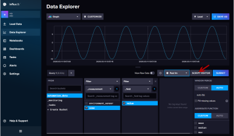

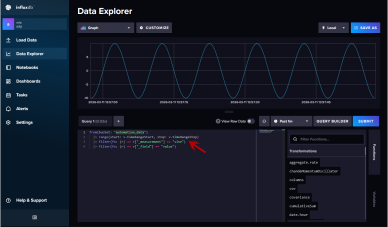

The data received from the _influxdb in_ node can be found in the `msg.payload` field. As it is possible to receive multiple data points, the `payload` fields is of type _array_. To access the first entry of the array we need to access the data with the index operator. 

Here and example to extract the first entry of the received data:

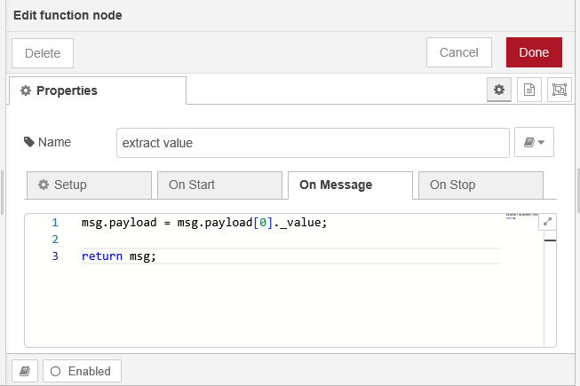

The code above, you need to put it into the  node.

Back to our Node-RED flow we can observe the received data in the debug view:

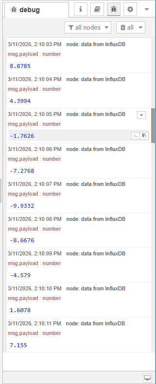

With the information provided in this section you are now able to read/fetch data from InfluxDB in Node-RED. There, you can afterwards use the data for further processing. 

# Install Grafana on ctrlX OS
This section will guide you through installing Grafana on your ctrlX OS system. Grafana is an open-source data visualization and observability platform used to create interactive, real-time dashboards for monitoring metrics, logs, and traces from diverse sources.

## Install _IoT Dashboard_ App
In the [ctrlX OS App Store](https://community.boschrexroth.com/ctrlx-os-store-apps-oc2pqqwn/) the app providing Grafana is named [ctrlX OS - IoT Dashboard](https://community.boschrexroth.com/ctrlx-os-store-apps-oc2pqqwn/post/ctrlx-automation---iot-dashboard-7kPDuOIDyw7TVLN). You can also download it from there or directly from the laboratory PC. On the laboratory PC, the _IoT Dashboard GDB-3.6.2+11.4.4-security-01.app_ file is located in the `C:\Users\Public\ctrlX\apps` folder. You can select and install the app from there.

After downloading the file, you can press the _Install from file_ button and reference the downloaded file to install the _IoT Dashboard_ application.

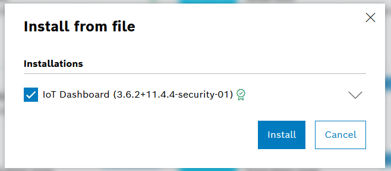

Click the _Install_ button. After installation the application shows up in the _Installed apps_ list:

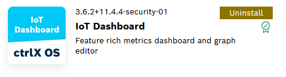

Grafana is now running on your ctrlX OS and you have a new _IoT Dashboard_ entry in the main navigation menu.

> Note: The _IoT Dashboard_ also provides a web interface to configure and access the dashboard. Example: https://127.0.0.1:8443/grafana (or https://127.0.0.1/grafana)

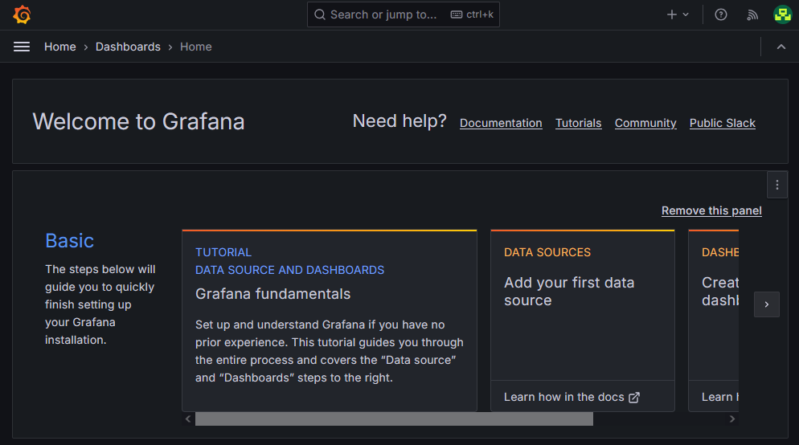

### Next Steps
1. Added _Data Source_
1. Create first Dashboard
1. Add a new Graph to Dashboard

## Configure New _Data Source_
Before creating the first Dashboard it makes sense to define the data source from which Grafana will request the data. Therefore, we want to connect our InfluxDB to Grafana.

In Grafana's _main navigation_ menu click on _Connections -> Data Sources_:
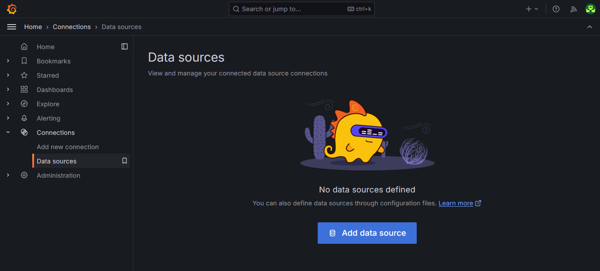

and click on the _Add data source_ button.

Use the _search_ field to find _influxdb_ as data source and add it:

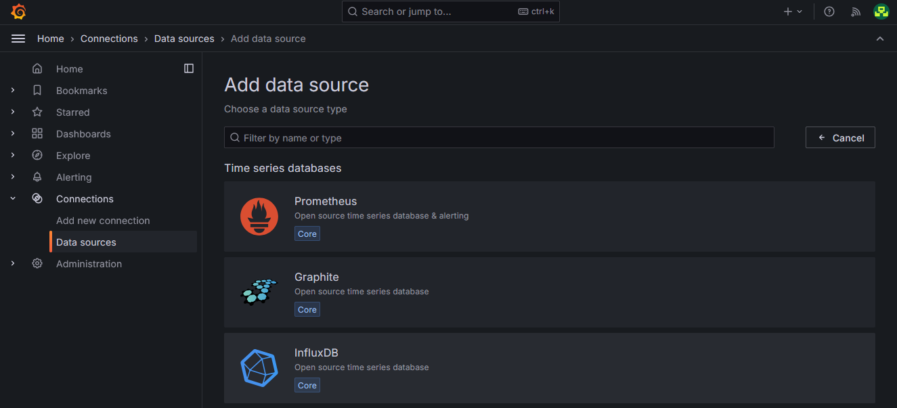

Click on the `InfluxDB` to select it as _data source_:
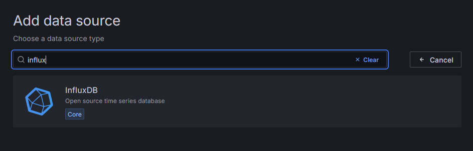

Give the new data source a meaningful name and select `InfluxQL` as query language:
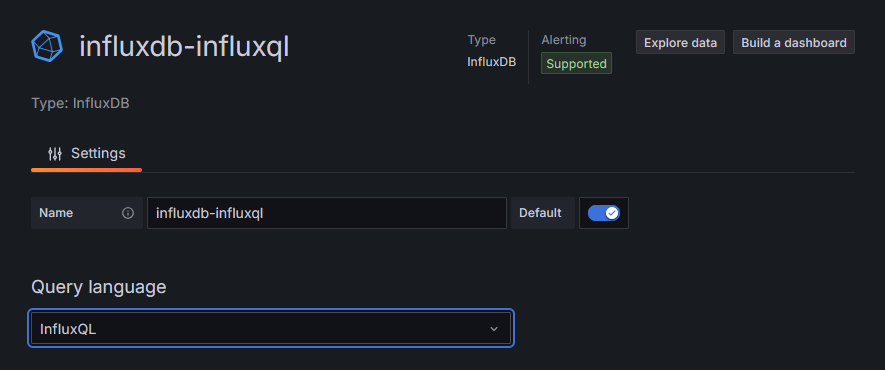

This option defines with which language/protocol Grafana is going to use to request data. 

> Note:
>
> There is also the option to take the [flux]() query language, but it isn't well-supported on the Grafana web interface. It is easier to set up a graph/dashboard in Grafana using the _InfluxQL_ query language.

Enter in the field named _URL_ the name of the server (typically http://localhost:8086):
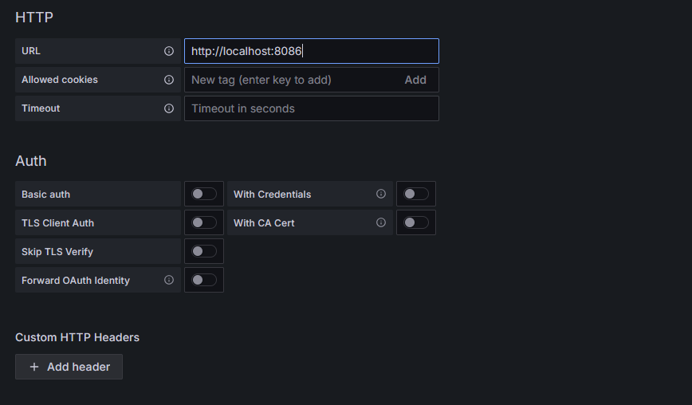
> Note: Per default the field suggests already a text (field surrounded with a red glow), but in this case the field is still empty! You need to fill the field with the name of the InfluxDB server! 

Next you need to provide the _database_ name and the _user credentials_. In the password field you need to enter the API token:

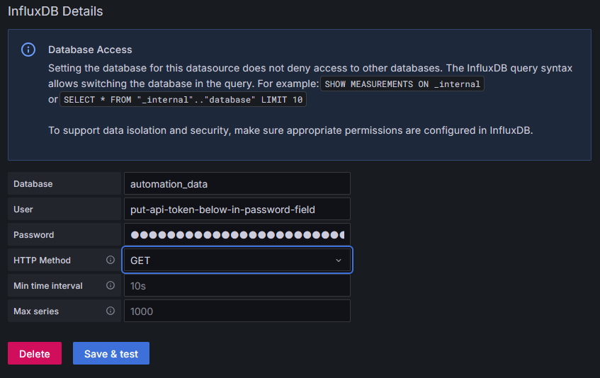

- **Database**: The name of the bucket
- **User**: Can be empty. You can enter whatever text you like
- **Password**: The _API token_ provided by InfluxDB

You can test if Grafana is able to reach the InfluxDB server by clicking on the `Save & test` button:

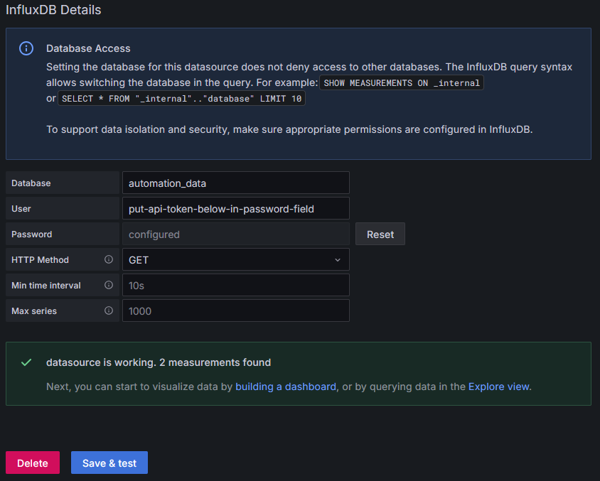

In case the connection test was successful a green box is shown with the amount of tables (measurements) found in the database.

## Create First Dashboard
Grafana allows to create and customise dashboards to show information using different visualisation possibilities:

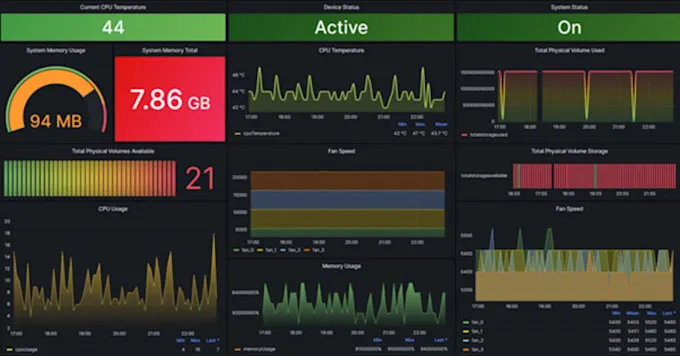

Open Grafana by clicking on the _IoT Dashboard_ in the ctrlX OS's main navigation menu:

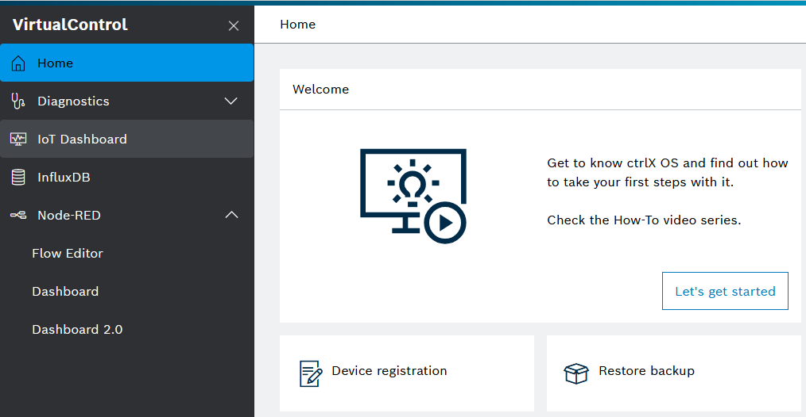

Click on the _Dashboards_ entry on Grafana's main navigation menu:

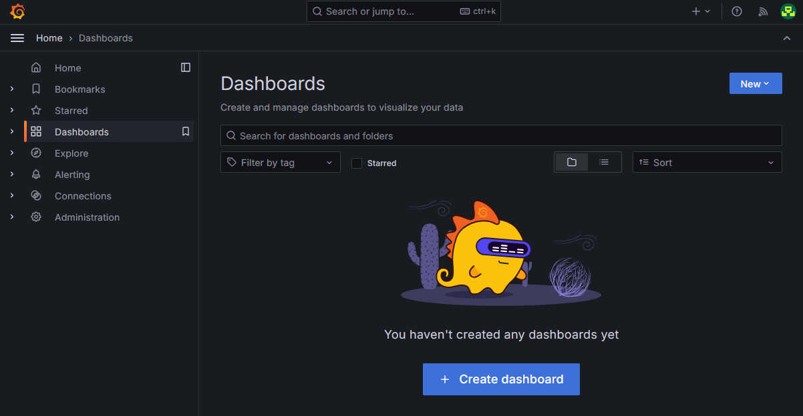

and click on the `➕ Create dashboard` button.

Add a new visualisation element on the dashboard:

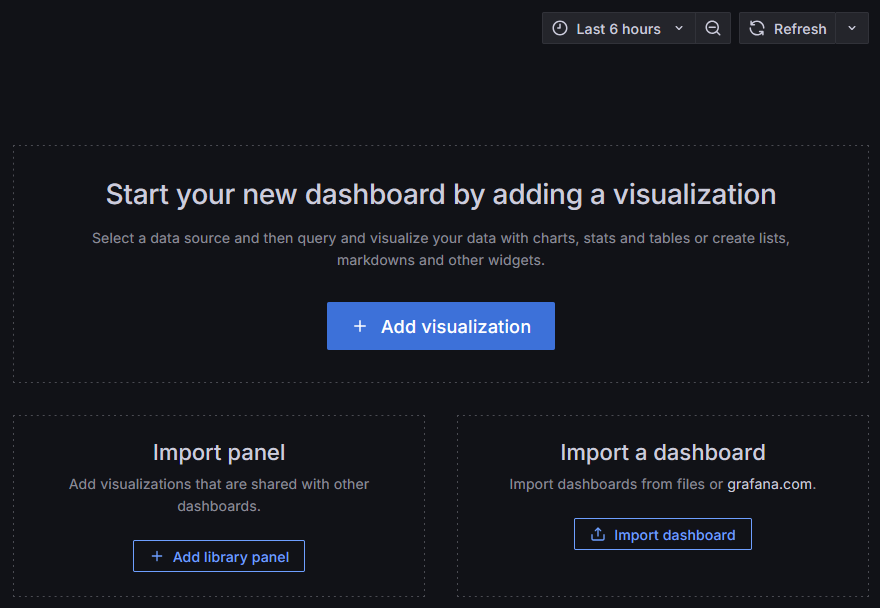

Select the data source from where you want get the data to be shown on the visualisation:

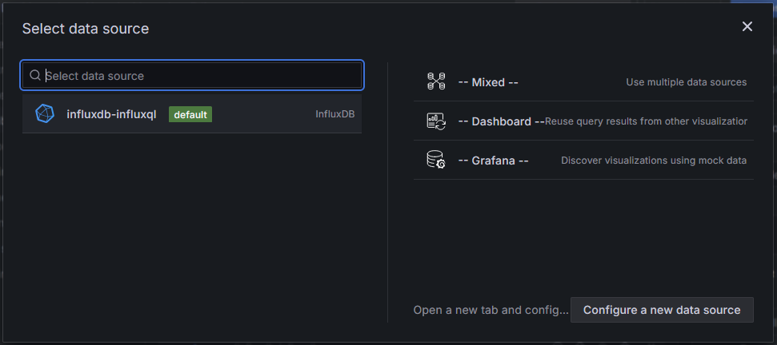

Select _influxdb-influxql_ (The data source we set up in a previous chapter).

Per default a `Time series` visualisation shows up:

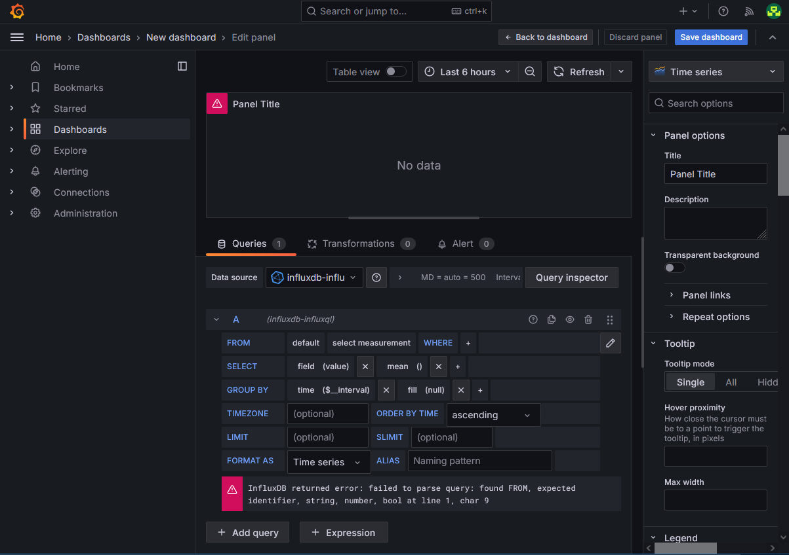

Down in the configuration windows search for the `FROM` field and select _sine_ as the table from where we want to get the data:
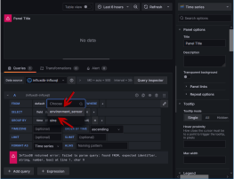

You can change the time range from `Last 6 hours` to `Last 5 minutes`:

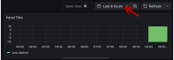

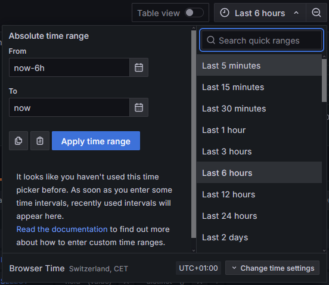

and we have our _sign_ measurement on our _time series_ visualisation:
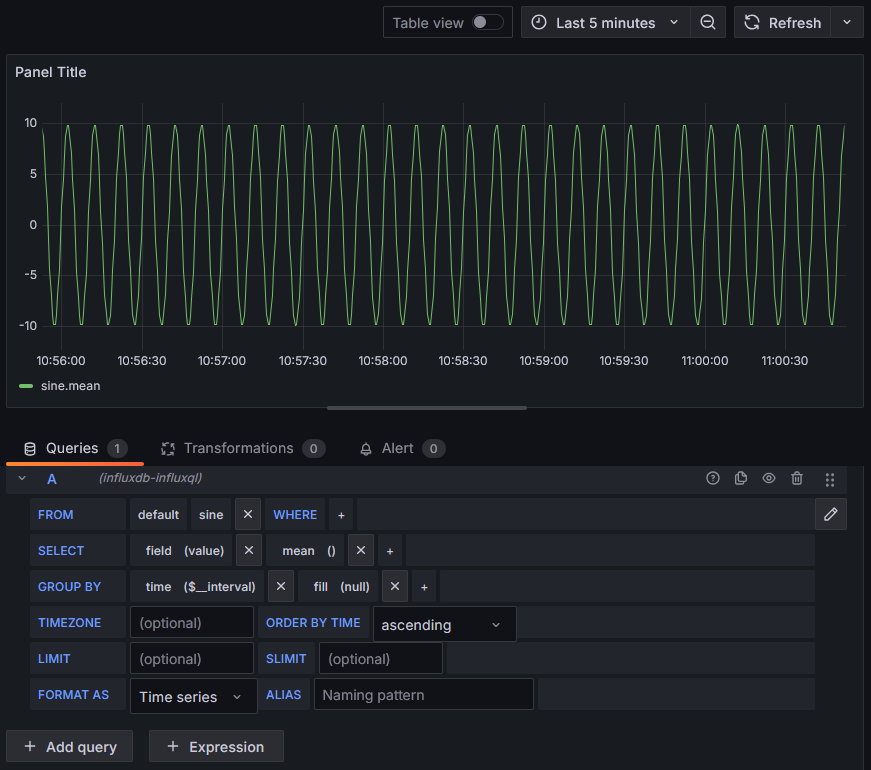

Now we can save the dashboard:
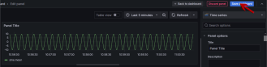

Giving the dashboard a meaningful name and _save_ it:
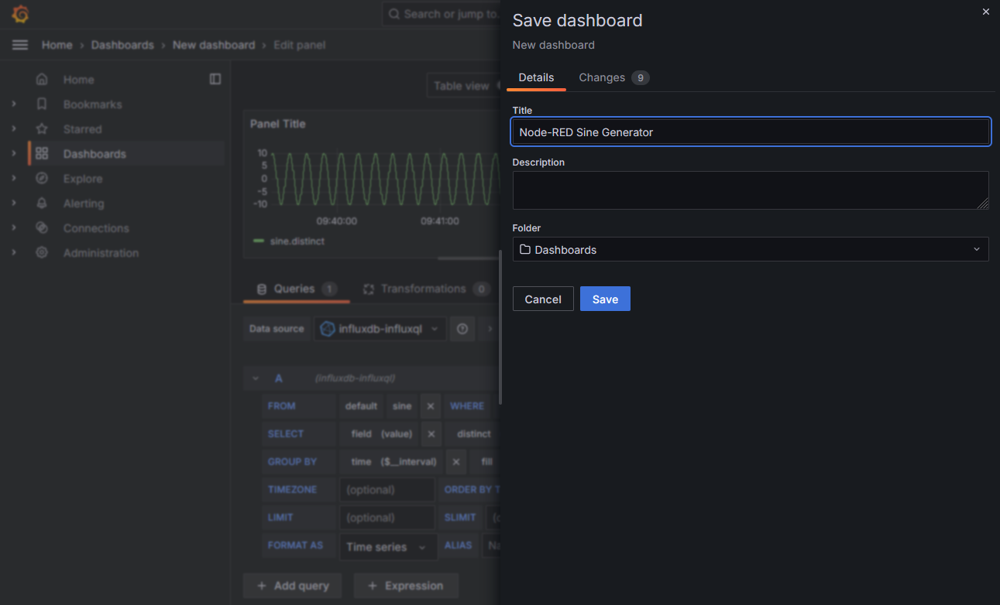

And we have our first _Dashboard_:

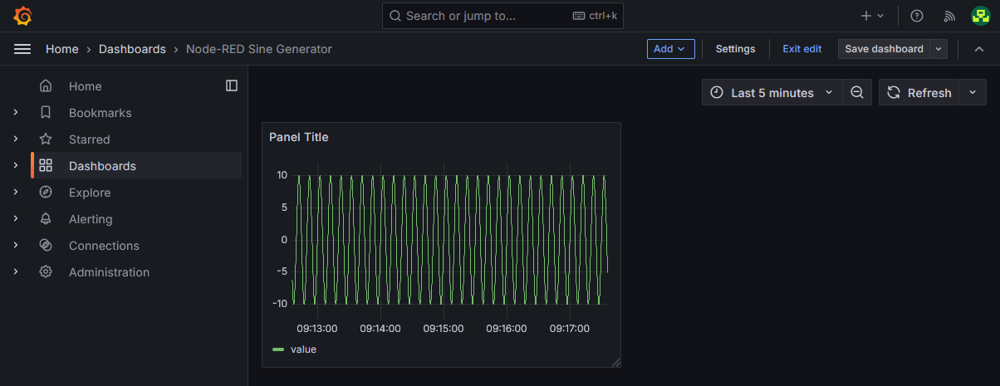

You can at any time edit the dashboard and add more visualisations. Also, there are no limits for the amount of Dashboard that can be shown in Grafana.

Go back in the _time series_ visualisation and play around with the options and parameters provided.

Now you are able to set up and show any data stored in a database and visualise it using Grafana.

<!-- end of file -->
